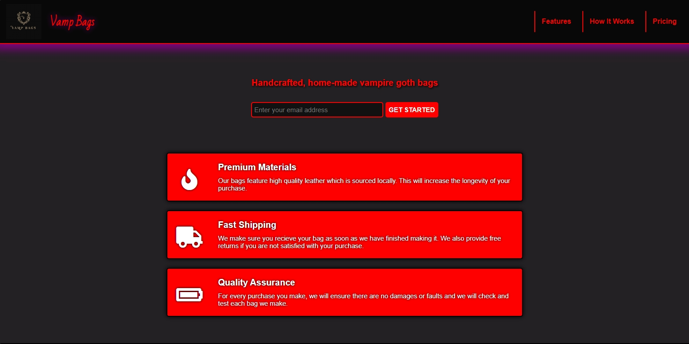

# 👜 Vamp Bags | Product Landing Page

## 📖 Overview

This project is part of my FreeCodeCamp Responsive Web Design Certification.
The objective was to build a Product Landing Page using only HTML and CSS. To demonstrate HTML/CSS layout, responsive design, and form handling.

I chose to create "Vamp Bags", a fictional gothic/fantasy-inspired brand, because I enjoy dark aesthetics and wanted to give the page a unique personal style.

The page showcases a product lineup, features section, embedded video, responsive layout, and working email signup form that fulfills all the required user stories.

## ✨ Features

- Fixed top navigation bar that remains visible while scrolling.
- Logo and navigation links inside the header.
- Email sign-up form with HTML5 email validation.
- Product showcase with Features, Video, and Pricing sections.
- Embedded YouTube video in “How It Works.”
- Responsive layout with CSS Flexbox and a media query.
- Styled buttons, hover effects, and consistent gothic/fantasy design theme.
- Footer with developer credit and external link.

## 🛠️ Built With

HTML – semantic structure, content, and form

CSS – styling, flexbox layout, responsiveness, hover effects

## 🧰 Skills Demonstrated

- Semantic HTML structuring
- Responsive design with CSS (flexbox + media query)
- Fixed-position top navigation
- Form creation with input validation
- CSS theming and hover effects
- Used hover states and customized the design with gothic/fantasy-inspired styling.

## 🚀 How to Use

[`View Live Project`](https://midnight-developer-ts.github.io/product-landing-page/)

1. Use the top navigation to move between sections.
2. Enter your email and click Get Started to test the form submission.
3. Check out the Features, How It Works video, and Pricing product options.
4. Resize the browser window to see responsive adjustments.
5. Click Midnight Developer in the footer to view more about the developer on Linktree.

## 📂 Project Structure
product-landing-page/ `root file`

│── index.html `main webpage`  

│── css/ `styling folder`

│   └── styles.css `styling` 

│── images/ `image folder`

│   └── vamp-bags-logo.png `logo image`

│   └── website-favicon.png `favicon`

│   └── website-preview.png `preview image`

│── LICENSE `license details` 

│── README.md `project details` 

## 📌 Learning Goals

- Built a multi-section product landing page with semantic structure.
- Implemented a fixed-position top navbar with logo and links.
- Created a working email form with validation for user submissions.
- Embedded a YouTube video with the correct id="video".
- Styled products with flexbox layout and responsive design.

## 🎯 Certification Compliance
This project fully meets all FreeCodeCamp Responsive Web Design
Technical Documentation Page user stories and requirements.

## 📸 Preview

[`View Live Project`](https://midnight-developer-ts.github.io/product-landing-page/)

## 📄 License 

This project is provided for portfolio and educational review only. 
Copying, redistribution, or commercial use is prohibited. 

This project is licensed under a Midnight Developer Proprietary License. 
See the [LICENSE](https://github.com/Midnight-Developer-ts/product-landing-page/blob/main/LICENSE) file for full terms.
